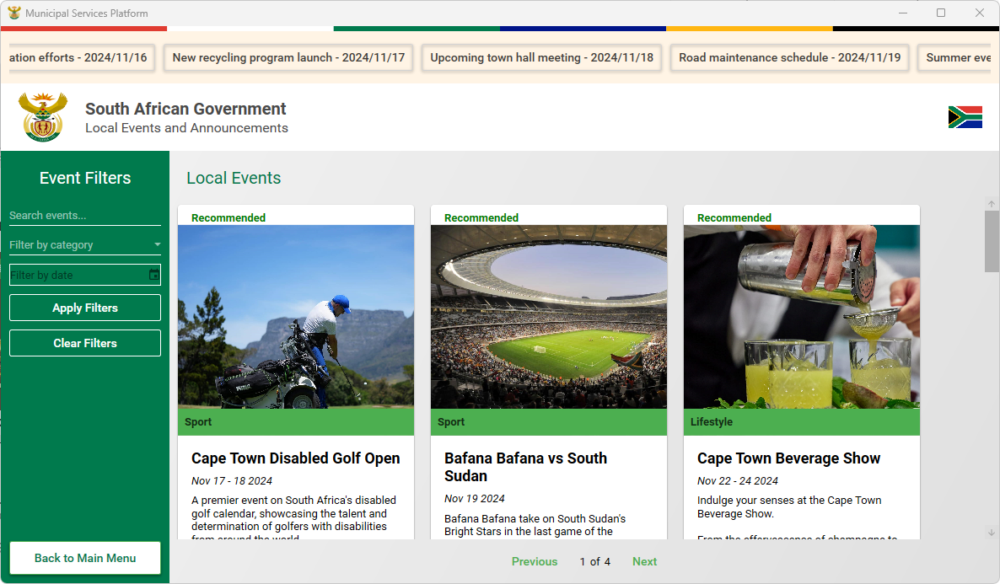

# Municipal Services Application

## About

The **Municipal Services Application** is a C# WPF (.NET Framework) desktop application designed to streamline citizen engagement and service delivery for municipalities in South Africa. This application provides an efficient and user-friendly platform where citizens can:
- **Report issues** such as sanitation, roads, and utility problems.
- **Attach media** (e.g., images, documents) to help clarify the reported issues.
- **Track the status** of service requests (this feature will be added in future updates).
- **View local events and announcements** (this feature will also be added in future updates).

The application is designed with a modern user interface, which includes animations, a clean colour scheme, and a data grid to display all reported issues.

## Features

1. **Report an Issue**
   - Citizens can report issues in various categories (e.g., Sanitation, Roads, Utilities).
   - They can specify the location, describe the issue in detail, and attach media files (images, etc.).
   - A progress bar dynamically updates as users complete each section of the report.
   - All submitted issues are displayed in a data grid in the main window.
   - **Address Autocomplete**: Utilizes the Places API for autocomplete suggestions when searching for addresses in the report issue window.

2. **Modern User Interface**
   - The app has a modern, user-friendly interface with smooth animations.
   - Features such as a custom ComboBox template, fade-in animations, and consistent colour schemes make the app intuitive and engaging for users.

3. **Dynamic Engagement**
   - A progress bar provides feedback to users as they complete sections of the form, encouraging engagement and making the reporting process smooth and transparent.

4. **Responsive Design**
   - The application is designed to be responsive with a minimum window size to ensure it works well across different screen resolutions.

5. **Advanced Data Structures Implementation**
   - **Red-Black Tree**: Ensures O(log n) operations for service request management
   - **Priority Heap**: Efficiently handles emergency and priority-based requests
   - **Service Request Graph**: Manages relationships between related service requests
   - **Service Status Tree**: Provides hierarchical view of service statuses
   - **Emergency Notice Tree**: Manages critical municipal announcements and alerts

6. **Automated Event Aggregation**
   - Built-in web scraper that automatically fetches local events from eventsincapetown.com
   - Asynchronous batch processing of events to maintain UI responsiveness
   - Intelligent date parsing for various date formats
   - HTML content cleaning and formatting for consistent display
   - Automatic image URL resolution and fallback handling

## Technologies Used

- **Language**: C# (WPF using .NET Framework 4.7.2)
- **UI Framework**: Windows Presentation Foundation (WPF)
- **Data Structures**: 
  - Red-Black Tree for balanced request management
  - Binary Heap for priority queue implementation
  - Graph structure for related issues
  - Service Status Tree for status management
  - Emergency Notice Tree for managing alerts
- **API**: Google Places API for address autocomplete
- **IDE**: Visual Studio

## Requirements

To run the **Municipal Services Application**, the following software is required:
- **.NET Framework 4.7.2 or higher**
- **Windows OS**
- **Visual Studio** (for development and running the application)

## Implementation Details

### 1. Data Structures

#### Red-Black Tree
- Ensures O(log n) time complexity for insertions and searches
- Self-balancing for consistent performance
- Used for efficient service request storage and retrieval

Example usage:
```csharp
var requestTree = new RedBlackTree();
requestTree.Insert(new ServiceRequest { RequestId = "REQ-123" });
var request = requestTree.Find("REQ-123");
```

#### Priority Heap
- Manages priority-based service requests
- O(log n) insertion and extraction of highest-priority requests
- Efficient handling of emergency situations

Example usage:
```csharp
var requestHeap = new ServiceRequestHeap();
requestHeap.Insert(new ServiceRequest { 
    RequestId = "EMERGENCY-123",
    Priority = 10
});
var urgentRequest = requestHeap.ExtractMax();
```

#### Service Request Graph
- Tracks relationships between service requests
- Enables pattern analysis and related issue identification
- Supports geographical clustering of issues

#### Service Status Tree
- Manages overall status of municipal services
- Provides quick status lookups and updates
- Hierarchical organization of service statuses

#### Emergency Notice Tree
- Singleton pattern implementation for emergency notifications
- Manages critical municipal announcements and alerts
- Provides quick access to emergency notices by severity

Note: The current implementation uses a List-based storage mechanism rather than a true tree structure. Future updates will implement a proper tree-based structure to enable:
- Organization of notices by severity
- Proper tree balancing
- Enhanced search functionality
- Efficient deletion of old/resolved notices

Example usage:
```csharp
var emergencyTree = EmergencyNoticeTree.Instance;
emergencyTree.Insert(new EmergencyNotice { 
    Title = "Water Interruption",
    Severity = "Warning"
});
var notices = emergencyTree.GetAll();
```

### 2. Performance Considerations

#### Time Complexity
- Red-Black Tree Operations: O(log n)
- Priority Heap Operations: O(log n)
- Graph Operations: O(1) for adjacent lookups

#### Memory Optimization
- Lazy loading of related data
- Efficient node structure design
- Minimal memory overhead in balanced trees

#### Scalability Features
- Balanced tree structures for consistent performance
- Priority-based processing for critical issues
- Graph-based relationship management

### 3. Event Web Scraper

The application includes a robust web scraping system implemented in the `EventService` class that:

- **Asynchronous Data Fetching**
  - Uses `HttpClient` for non-blocking web requests
  - Processes events in configurable batch sizes to prevent UI freezing
  - Implements a completion source pattern for load state management

- **HTML Processing**
  - Utilizes HtmlAgilityPack for reliable HTML parsing
  - Extracts event details including:
    - Title and description
    - Date and time information
    - Category classification
    - Image URLs
    - Event webpage links

- **Data Cleaning**
  - Handles various HTML entities and special characters
  - Normalizes date formats from multiple input patterns
  - Resolves relative and absolute image URLs
  - Provides fallback images for events without pictures

Example usage:
```csharp
var eventService = new EventService();
await eventService.GetEventsAsync(
    onEventProcessed: (localEvent) => {
        // Process each event as it's scraped
    },
    batchSize: 12
);
```

## Getting Started

### 1. Clone the Repository

First, clone the repository from GitHub:

```bash
git clone https://github.com/davidrmellors/MunicipalServicesApplication.git
```

### 2. Open the Solution

1. Open **Visual Studio**.
2. From the top menu, select **File > Open > Project/Solution**.
3. Navigate to the folder where you cloned the repository and open the `.sln` file.

### 3. Build the Solution

1. In **Solution Explorer**, right-click on the project name (**MunicipalServicesApplication**).
2. Click **Build** to compile the project and ensure all dependencies are installed.

### 4. Run the Application

1. After the build completes successfully, press **F5** or click the **Start** button to run the application.
2. The main window will open, presenting options to report an issue or exit the application.


## How to Use the Application

This section provides detailed steps on how to use the Municipal Services Platform and the underlying data structures that power each feature:

### 1. Login
Access the platform by entering your South African ID number on the login screen and clicking "LOGIN".  
**Data Structure**: Red-Black Tree for user authentication and session management


### 2. Home Screen
After logging in, the home screen provides an overview of critical service alerts, emergency contacts, essential service statuses, and your active service requests.  
**Data Structures**: 
- Emergency Notice Tree for critical alerts
- Service Status Tree for essential service statuses
- Red-Black Tree for active service requests


### 3. Report an Issue - Step 1: Select Location
Navigate to the "Report an Issue" section. Use the location autocomplete feature to select or type the location where the issue occurred.  
**Data Structure**: Service Request Graph for geographical clustering and location management


### 4. Report an Issue - Step 2: Fill Details
Choose the issue category, provide a description, and complete the necessary details for the issue report.  
**Data Structure**: Red-Black Tree for storing and managing service requests


### 5. Report an Issue - Step 3: Add Attachments
Add any relevant attachments, such as images or documents, to support your issue report before submitting.  
**Data Structure**: Red-Black Tree for attachment management linked to service requests


### 6. View Local Events
Access the "Local Events and Announcements" section to view upcoming events and announcements tailored to your municipality.  
**Data Structures**: 
- `SortedDictionary<DateTime, List<LocalEvent>>` for organizing events by date
- `Dictionary<string, HashSet<LocalEvent>>` for organizing events by category
- `Queue<LocalEvent>` for managing upcoming events
- `Stack<LocalEvent>` for managing past events
- `List<Announcement>` for storing announcements


### 7. Filter Events
Use the filter options to search for events based on categories or specific dates.  
**Data Structure**: Uses the same collections as above, with LINQ queries for filtering


### 8. Check Service Request Status - Step 1: Search by ID
In the "Request Status" section, search for your request using its unique request ID.  
**Data Structure**: Red-Black Tree for O(log n) request lookup


### 9. Copy Request ID
Quickly copy the unique ID for any of your requests to your clipboard for easy sharing or reference.  
**Data Structure**: Red-Black Tree for request ID management


### 10. Check Service Request Status - Step 2: View Details
View the detailed status of your service request, including attachments and related issues.  
**Data Structures**: 
- Service Status Tree for status hierarchy
- Service Request Graph for related issues
- Priority Heap for emergency and high-priority requests


---

For any additional assistance or questions, please contact support at [support@municipalservices.gov.za](mailto:support@municipalservices.gov.za).
